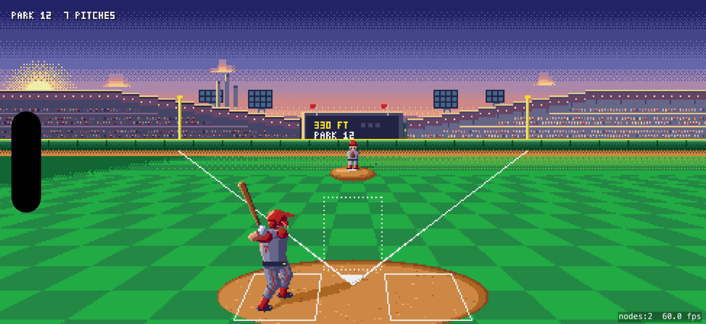
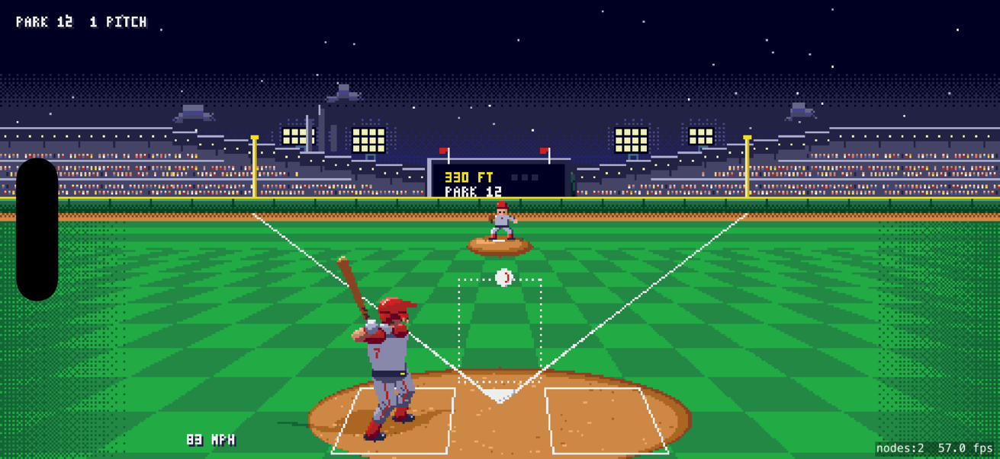
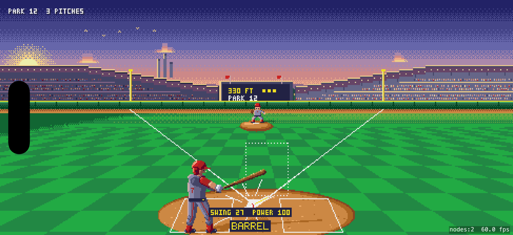
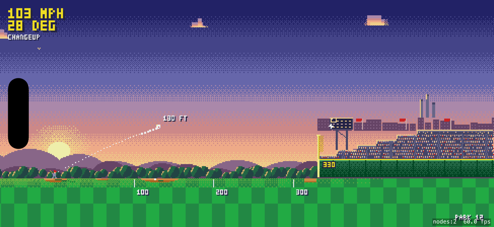
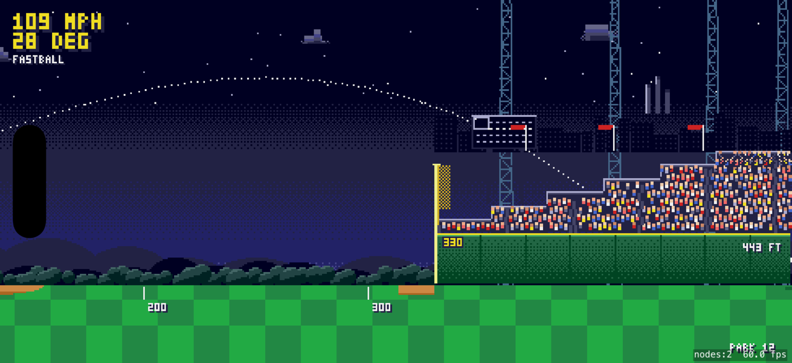
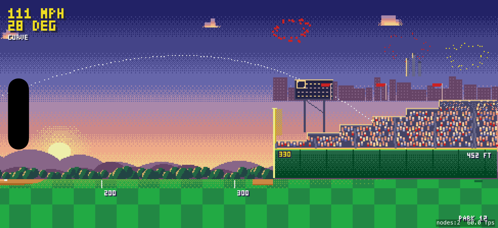
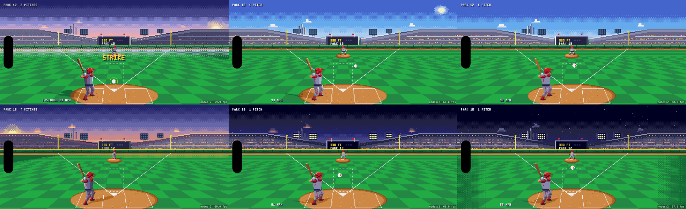

# Sandlot Derby

A minimalist home run derby for iOS. Forty-five colours, two cameras, one gesture.

The pitch comes at you. You slice through it, Fruit Ninja style. The direction of your slice is the
swing angle, its speed is the power. The frame freezes on the slash, then cuts to a wide side view
where the ball flies with real drag, and the only number that matters ticks up under it: feet.

No outs. No menus. No timers. Parks are seeded and endless. The score is total feet, forever.

## Screenshots


*At bat, golden hour. Full stands, a low sun, and a slice about to happen.*


*At bat under the lights.*


*The frame freezes on the slash — a BARREL, full power.*


*The cut to the wide view: real drag, feet ticking up.*


*The close cut, near the wall, at night.*


*A home-run streak earns fireworks.*


*The same at bat, six times a day: dawn, morning, midday, golden hour, twilight, night.*

- **Spec:** [`DESIGN.md`](DESIGN.md)
- **Physics and calibration oracle:** [`docs/physics.md`](docs/physics.md)
- **Palette:** [`docs/palette.md`](docs/palette.md)
- **Pure-Swift core (physics, pitching, contact, parks, state machine) with tests:** [`Core/`](Core/)
- **Playable HTML prototypes the spec was derived from:** [`prototypes/`](prototypes/)

## Status

M0 is done: `Core/` compiles and `cd Core && swift test` is green. A first runnable app covers the
bones of M1–M2: both cameras, the slice, the hard cut, flight playback and the landing number, drawn
from a port of the prototype. Milestones are in `DESIGN.md` §13.

```sh
cd App && xcodegen generate && open SandlotDerby.xcodeproj
```

The generated project is git-ignored; `App/project.yml` is the source of truth.

To build headlessly and capture simulator screenshots (for PR before/after shots), use
[`scripts/shots.sh`](scripts/shots.sh).

## Research trail

Three private pages hold the research, mood board and mechanic prototype this repo distils:

- Research note (market, physics, Apple guidelines, stack): https://claude.ai/artifact/HRGsgjyjBDuL8BAjeyyWfW
- 16-bit mood board: https://claude.ai/artifact/8U47awQommcAap6e6nza6n
- Camera cut and slice prototype: https://claude.ai/artifact/MnDGhy6sJmSNQciwWwvB7T

The same three pages are checked in under `prototypes/` so the repo stands on its own.
