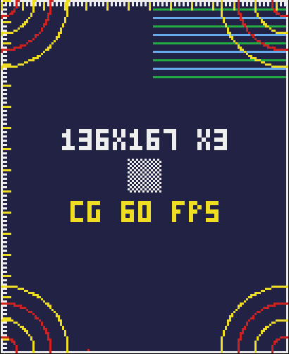

# W0 — the watch spike

Half a day with the watch on the wrist. The output is **measured numbers in place of the guesses
in [`docs/watch.md`](../docs/watch.md)** (§9). This app is not the game. It is a watch-only
target with its own bundle id (`com.m0n01d.sandlotderby.watchspike`), so it is never embedded in
the phone app and cannot change the phone app's build.

## Run it

```sh
cd App && xcodegen generate && open SandlotDerby.xcodeproj
```

Pick the **`DerbyWatchSpike`** scheme and the paired watch as the destination, then Run. The watch
needs Developer Mode (Settings → Privacy & Security on the watch). The first install over Wi-Fi
can take several minutes.

Everything the pages measure also prints to Xcode's console as `W0 …` lines. Page 7 shows the
same log on the glass.

## The pages, and what to write down

The rendered pattern at Ultra size (`pattern-ultra.png`, drawn by the same code on Linux) is what
page 1 should look like:



| # | Page | Do | Write down |
|---|---|---|---|
| 1 | Pattern (image) | Screenshot the watch (side button + Crown), zoom in on the checkerboard | Is each cell exactly 3×3 physical pixels, with no smeared rows? Is the white border visible on all four sides? The FPS figure |
| 1 | ″ | Look at the corners | Which ring is the last whole one in each corner: 8, 16, 24 or 32 units (red, yellow, red, yellow outwards)? |
| 1 | ″ | Look at the top right | How many of the ten stripes does the clock cover? The stripes are 4 units apart |
| 2 | Pattern (sprite) | Same as page 1 | Does `SKMutableTexture` draw at all? Is it pixel-exact? Its FPS against page 1's. **Which blit path wins** |
| 3 | Drag | Slice across the glass twenty times, as if at a pitch, both short flicks and long strokes | Sample rate (Hz) and the gaps. Stroke length and peak speed in units. These feed `WatchSliceRules` (`fullPowerLength` guess 61 u, `fullPowerSpeed` guess 440 u/s) |
| 4 | Haptics | Feel each one, first silenced, then not | Which ones are crisp enough for contact, the wall and the pitch tick? **Which ones also sound a tone when not silenced** (§6's trap) |
| 5 | Sound | Each button, silenced and not | Does *ambient* play when silenced (the spec expects not)? Does *playback*? Render and start times |
| 6 | Battery | Start, keep the wrist up for five minutes, then tap | Battery % at start and end, and FPS. Try both paths if there is time |
| 7 | Info + log | Read it. Then lower the wrist and raise it again on any page | Model, points, pixels, canvas, safe insets. The `scenePhase` lines the wrist produces (§5's resume logic hangs on them) |

## Results

Fill this in on the day, then fold the numbers into `docs/watch.md` and delete the rows that
match the guesses.

| Measure | Guess (docs/watch.md) | Measured |
|---|---|---|
| Screen, physical px | 410×502 (Ultra) | |
| Canvas and scale | 136×167 at 3 | |
| Pixel-exact at 3 px/unit | yes | |
| Blit path | `SKMutableTexture`, `TimelineView` fallback | |
| FPS, image / sprite | 60 | |
| Corner: last whole ring | — | |
| Clock covers stripes | — | |
| Drag sample rate | — | |
| Typical slice length, units | 61 for full power | |
| Typical peak speed, u/s | 440 for full power | |
| Haptics that sound a tone | unknown | |
| Crisp haptics for contact / wall / tick | `.click` `.start` / `.success` `.directionDown` / `.click` | |
| Ambient audio when silenced | no | |
| Battery, % per 5 min at 60 fps | — | |
| Wrist down → `scenePhase` sequence | inactive, then background | |

## Found before the watch arrived

- **The `t5` face is not a full alphabet.** It has digits, `A B E F H L R T`, `$ £ ¥ €`, space, comma
  and full stop. That was enough for the landing number and `HR`, but §4's watch HUD
  (`PARK n · PITCHES`, the readouts) and §7's contract card (`THE SHOW`, `ONE TIME`,
  `NO SUBSCRIPTION`) need letters it lacks. Either `t5` gets the rest of the alphabet before W2,
  or the watch uses `t3` at 2×, a 6×10-unit glyph. The spike's own labels use `t3` at 2×.
- **§3's fit rule holds for every size in its table.** `WatchCanvas.fit` gives 136×167, 140×171,
  138×165, 198×242 and 162×197, checked on Linux. The table's pixel sizes are still from memory
  until page 7 confirms them.
