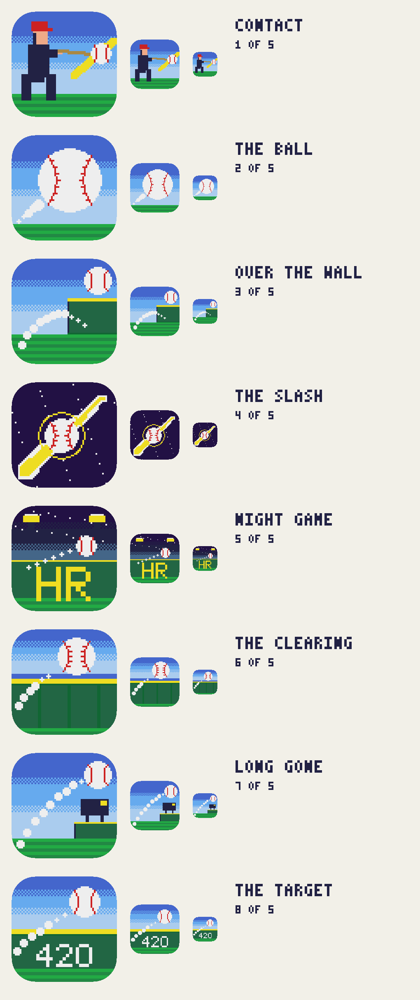

# App icon candidates

Eight icons, one palette line. Each is drawn as 64×64 pixel art and scaled ×16 to the App Store's
1024, nearest-neighbour, so the pixel grid survives all the way to the home screen. Regenerate with:

```sh
python3 scripts/icons.py
```

Pick one with `scripts/pick-icon.sh 01` (or `02`…`08`); it copies that candidate into
`App/Assets.xcassets/AppIcon.appiconset/`. **08 THE TARGET ships today.**



## The rules the icons obey

The same ones the game does, because an icon that breaks them is advertising a different game:

- **One palette line.** Every colour is from `docs/palette.md` and keeps its job — `cap` red is only
  a cap and a seam, `score` yellow is only the slash and the scoreboard, `chalk` is only the ball
  and its trail. No sixteenth colour was invented for the icon.
- **No anti-aliasing, no gradients, no alpha.** The ×16 scale is an integer, so a source pixel is a
  16×16 block and nothing is ever resampled. The sky's bands are the only soft-looking thing on
  screen, and they are a four-row checkerboard dither, exactly as §2 of the palette doc allows.
- **Inside the mask.** iOS rounds the corners at ~22.4% of the width. Nothing that carries meaning
  sits in a corner; the contact sheet renders the mask so you can see what gets cut.
- **It has to work at 60 px.** The contact sheet shows every candidate at 256, 120 and 60 — the
  last is the real home-screen size, and it is the only one that decides anything.

## Where the ideas came from

Straight out of `prototypes/02-mood-board.html`, which already did the research:

| Source | What the icons take |
|---|---|
| **Champion Baseball** (Sega, 1983) | That a baseball game may cut to a *portrait* for the moment of contact. That is icon 01 — not a field, a swing. |
| **R.B.I. Baseball** (Tengen, 1988) | Stubby proportions. A three-head-tall batter reads instantly at 16 px, which is the whole problem an app icon has. |
| **Hardball!** (Accolade, 1985) | How little colour a ballpark needs to still read as a ballpark. Icon 03 is a fence, a horizon and an arc. |
| **Clutch Hitter** (Sega, 1991) | Sega arcade colour: saturated primaries against one dark ink. That is the palette's `cap`/`score`/`ink` triangle. |
| **World Series Baseball** (BlueSky/Sega, 1994) | The outfield scoreboard: yellow type on wall green. Icon 05 is that and nothing else. |
| **Super Baseball 2020** (SNK, 1991) | Big scoreboard type over the wall — borrowed for 05's `HR`, and nothing else, because its palette is far too rich for us. |
| **Desert Golfing** | The restraint. One subject per icon. No badge, no burst, no wordmark. |

## The five

**01 CONTACT** — The hero beat, cropped close: the batter's silhouette at the
contact frame, the ball frozen where the bat met it, the slash through it in `score` yellow. This
is the one with a character in it, which is what earns the tap from a seven-year-old; it is also
the only one that shows the input and the result in the same picture. Busiest of the five at 60 px,
but the red cap and the yellow slash carry it — those two shapes are what the eye finds.

**02 THE BALL** — one object, as big as the frame allows, with the every-fourth-frame trail coming
in from the corner. The cleanest and the most legible of the five at any size, and the most
replaceable: any baseball app could wear it. Pick this if the App Store grid is the priority.

**03 OVER THE WALL** — the whole game as one shape. The wall is on screen from the first frame so
the goal is never explained (mood board, constraint two) and the icon does the same job: an arc,
a fence, a ball that has already cleared it. Warmest and most immediately readable as *home run*.

**04 THE SLASH** — the one gesture as a mark. A tapering `score` slice across a night field with
the ball frozen at the crossing and the contact ring around it. The boldest and by far the most
distinctive — nothing else on a home screen looks like this — but the most abstract, and it reads
as *baseball* a half-second later than the others do.

**05 NIGHT GAME** — the outfield scoreboard read, yellow on wall green, under the light towers.
The most nostalgic of the five and the one that most looks like a 1994 cartridge. Its `HR` is the
5×7 face the game uses for the landing number, unchanged.

## The wall family (03, 06, 07, 08)

Four framings of the one objective: get it over the wall. They share a grammar — a `score`-yellow
home-run line along the top of the fence, a chalk trail that crosses it, and a ball that is already
past. Each answers the question at a different distance.

**03 OVER THE WALL** — the establishing shot. Fence at the right, the arc coming up to meet it,
the ball just clear. Reads as *home run* fastest of the four and keeps the most field in frame.

**06 THE CLEARING** — the photo finish. The wall takes more than half the icon, seen from close
enough that the panel joins show, and the ball sits a few feet over the yellow line with the trail
still crossing it. The most dramatic, and the one that most looks like a *moment* rather than a
diagram. Its ball is the biggest of the four, which is what carries it at 60 px.

**07 LONG GONE** — pulled all the way back, so the answer is *how far*. The flight gets the whole
frame and is still climbing when it leaves it; the fence is small and far, and the out-of-town
board from park variety (#5) stands behind it on the stands — something for the ball to be past.
The only one of the four where the arc, not the wall, is the subject. The board reads a little like
a television on legs at 60 px; that is the honest cost of keeping it in.

**08 THE TARGET** — *ships today.* The objective painted on the thing itself. `420` in the game's
5×7 face, white on wall green like every outfield marker since the 1930s, with the ball crossing
the yellow line above it. This is the only icon of the eight that states a *goal* rather than
showing an event, and the number survives 60 px intact, which nothing else in the set manages.

`420` is a real centre-field marker — Comerica Park and Tiger Stadium both wore it — and it is
also a number some people will read the other way. That is the whole joke and the whole defence:
it is deniable in both directions, so nobody who misses it sees anything but a ballpark, and the
icon stays as kid-facing as `400` was. Swap it back in `icon_the_target()` if that ever stops
being true.

## Notes

- The file is a flat, opaque 1024 with no alpha, which is what the App Store requires and what a
  16-bit game should want. If iOS 26's light/dark/tinted variants are wanted later they can be
  added as a layered Icon Composer document; a single flat icon is a deliberate choice, not an
  oversight — the tinted treatment would grey out the exact three colours doing the work.
- `scripts/icons.py` shares its drawing primitives (`px`/`rect`/`line`/`disc`/`dither`) and both
  bitmap faces with the prototypes, so an icon and a frame of the game are drawn the same way.
